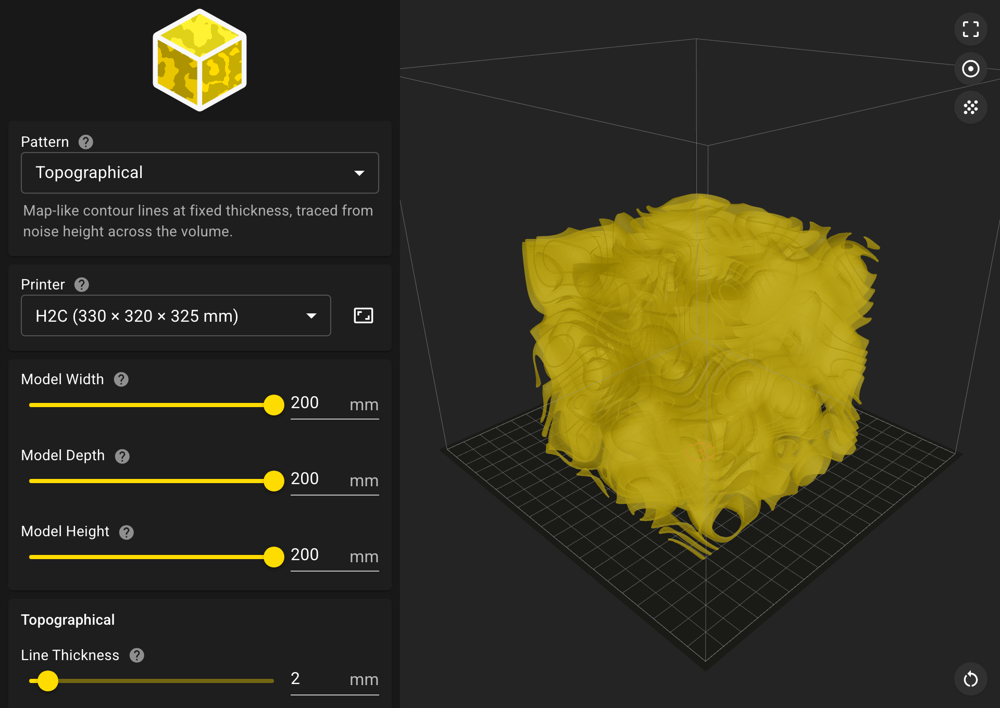
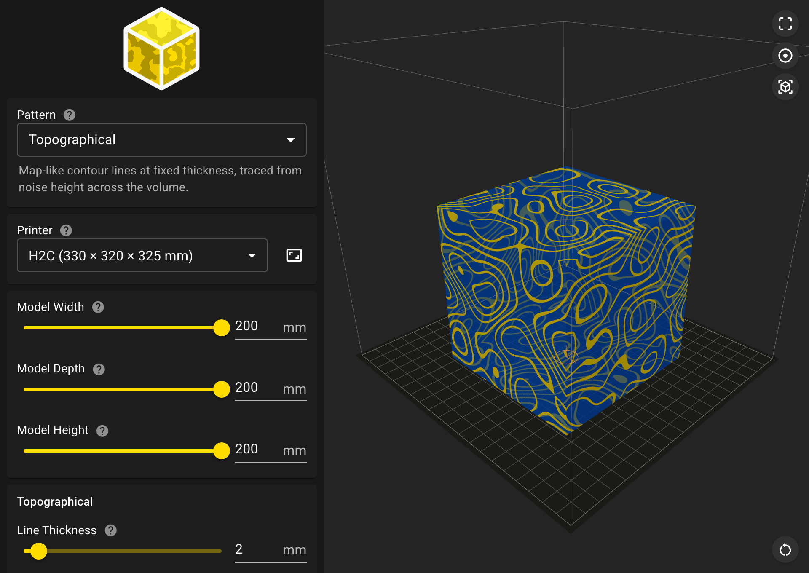
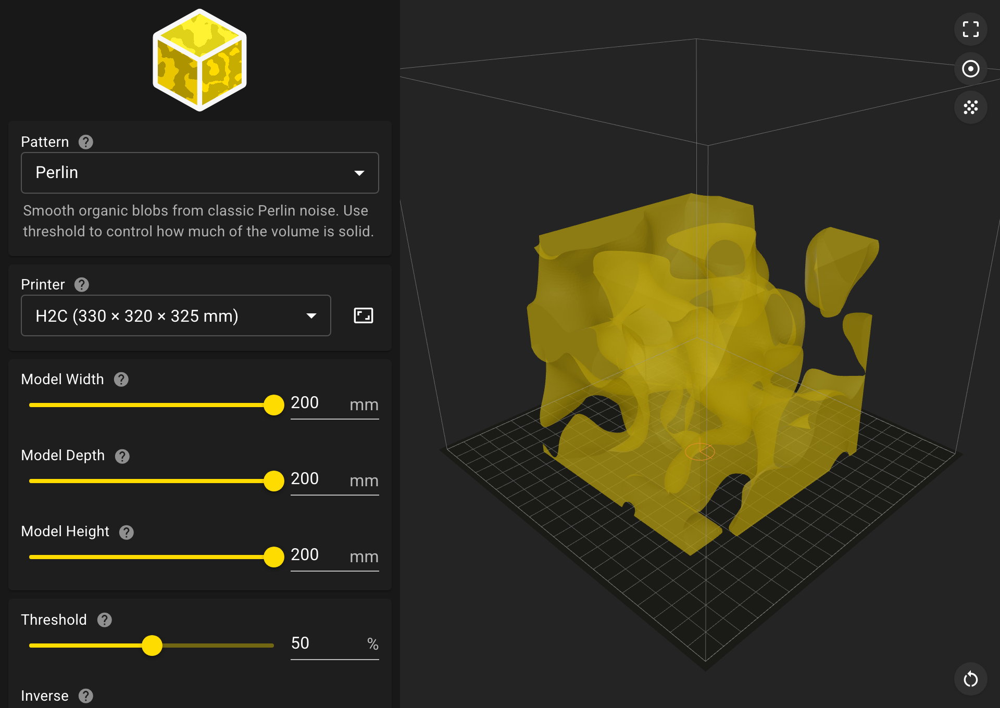
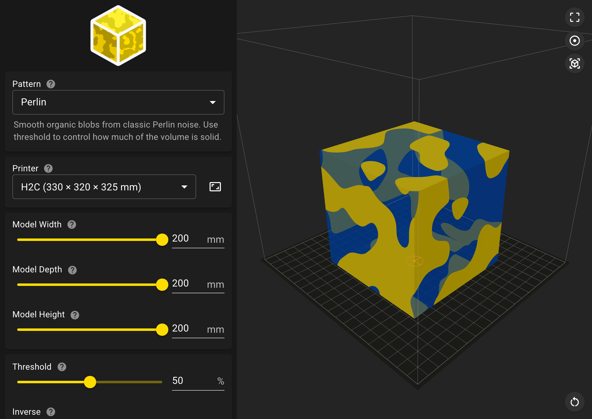
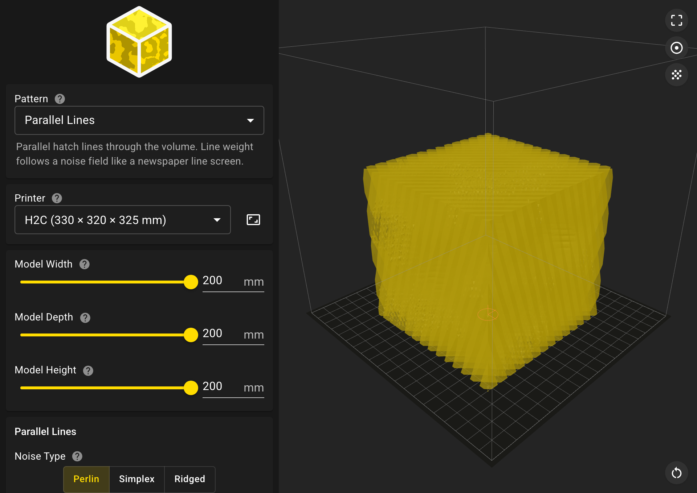
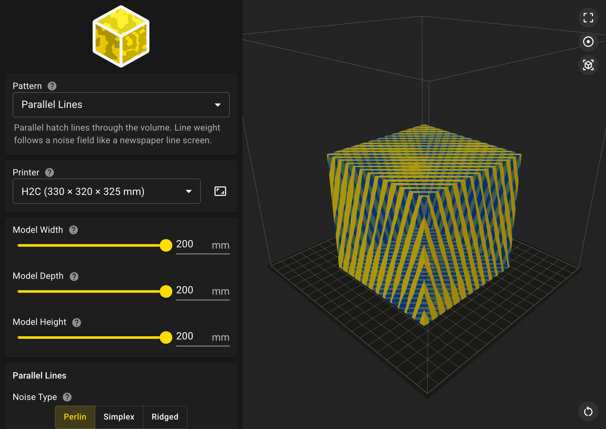
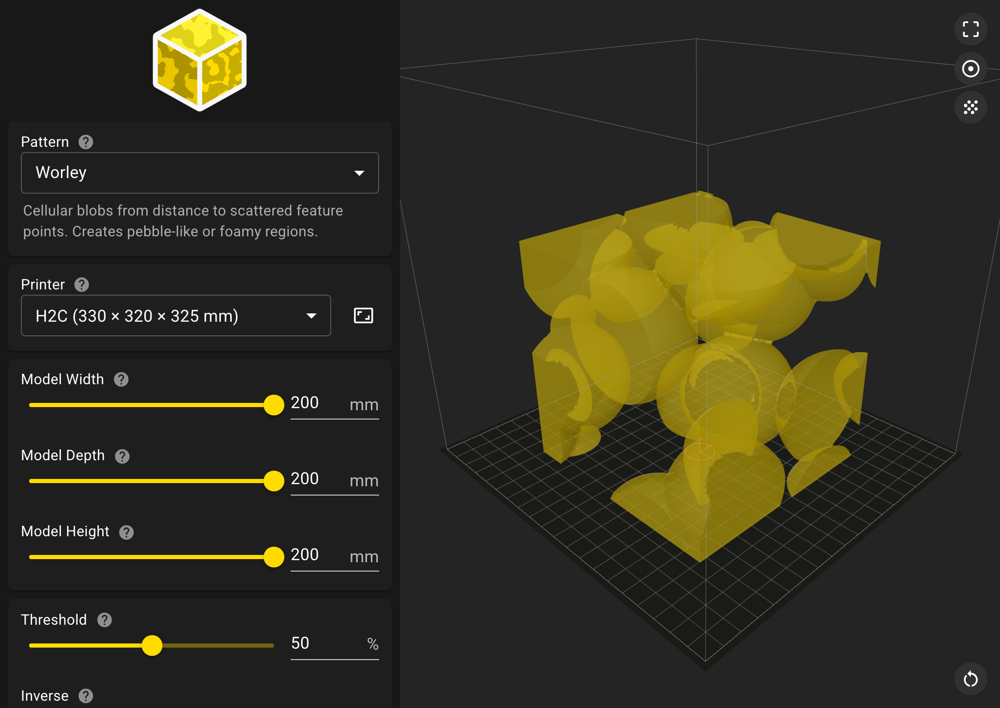
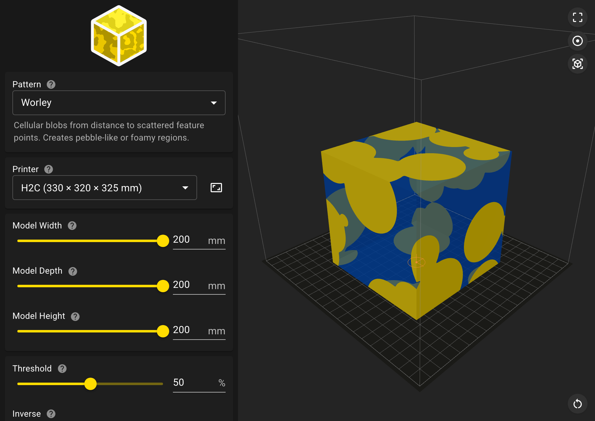
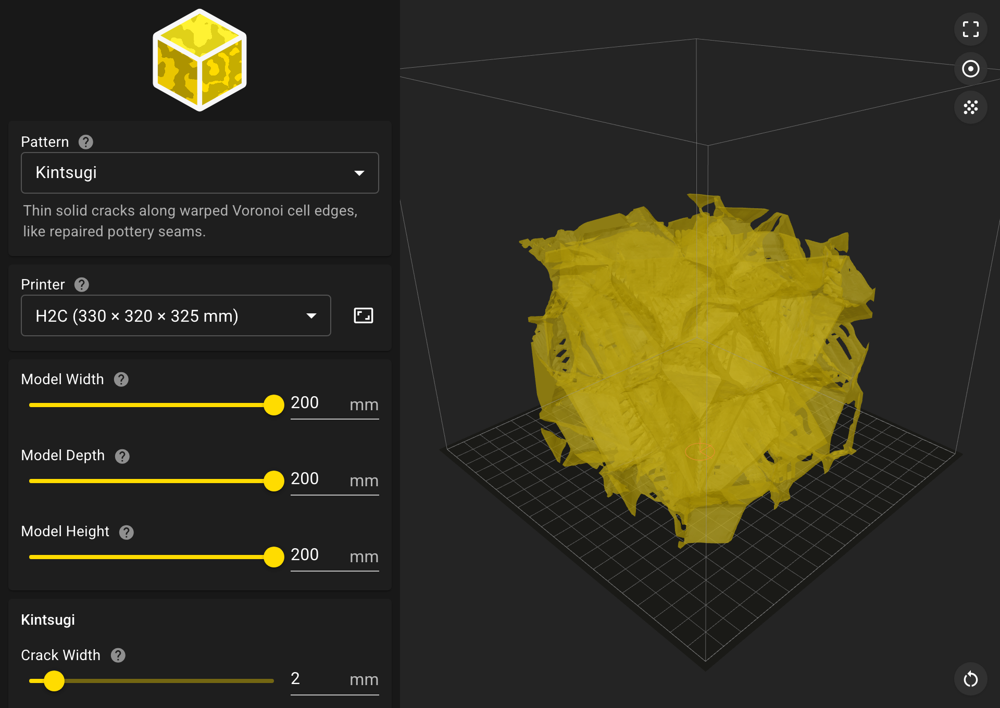
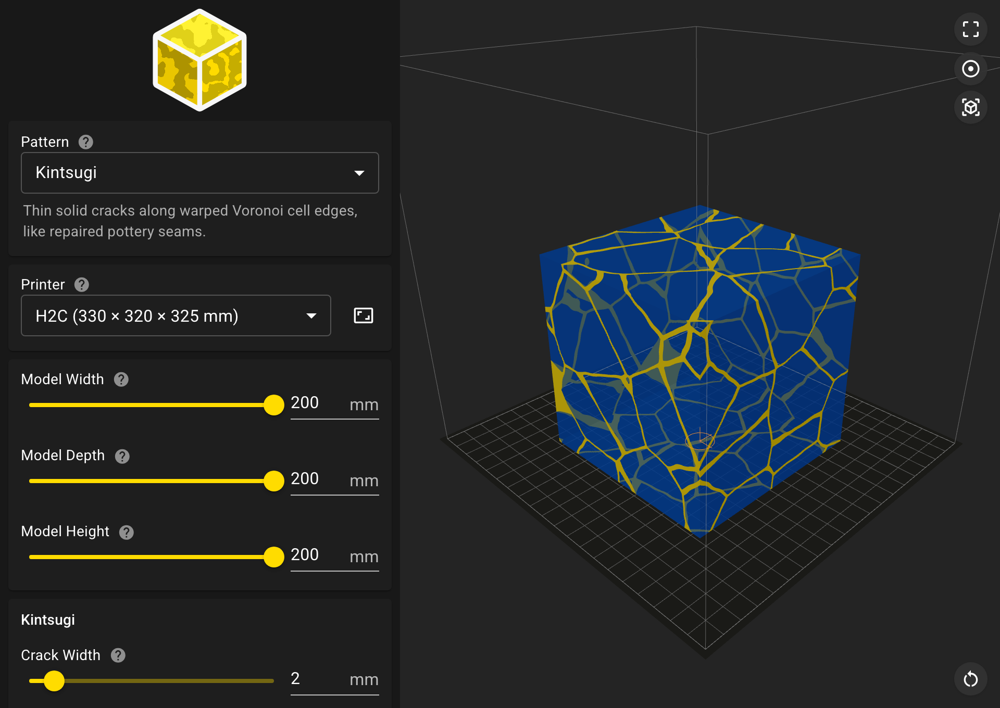

# Pattern Modifiers


Web app for generating **STL** and **3MF** files of 3D patterns for use as modifiers in slicer software (e.g. Bambu Studio, PrusaSlicer).

Try it live: [patterns.cannonbury.co.uk](https://patterns.cannonbury.co.uk/)

Pick a pattern, set the modifier box size in millimetres, tune the controls, and download a watertight mesh. Models are generated in printer coordinates (mm, Z-up) with the origin centred in X/Y at the build plate, so they drop into the slicer as a modifier with no repositioning. The printer preset only drives the build plate shown in the preview; model size is independent.

## Screenshots

 

 

 

 

 

## Pattern types

Patterns are grouped in the sidebar. Default is **Topographical**.

### Effects

| Pattern | Description |
|---------|-------------|
| Topographical | Map-like contour lines at fixed thickness, traced from noise height across the volume. |
| Marble | Flowing veined stone bands with domain-warped noise. |
| Kintsugi | Thin solid cracks along warped Voronoi cell edges, like repaired pottery seams. |
| Woodgrain | Concentric growth rings with optional knots, oriented along a chosen axis. |

### Noise

| Pattern | Description |
|---------|-------------|
| Perlin | Smooth organic blobs from classic Perlin noise. Use threshold to control how much of the volume is solid. |
| Simplex | Organic noise similar to Perlin, with cleaner gradients and fewer directional artifacts. |
| Ridged | Sharp ridges and valleys from inverted Perlin noise. Good for mountain-like or crackled textures. |

### Shading

| Pattern | Description |
|---------|-------------|
| Cross-hatch | Two sets of diagonal hatch lines crossing through the volume. Stroke weight and cross-hatch density follow a noise field. |
| Parallel Lines | Parallel hatch lines through the volume. Line weight follows a noise field like a newspaper line screen. |
| Halftone | Stippled dots of varying size on a 3D grid, merging smoothly where they overlap. |

### Cellular

| Pattern | Description |
|---------|-------------|
| Worley | Cellular blobs from distance to scattered feature points. Creates pebble-like or foamy regions. |
| Voronoi | Solid cell walls between Voronoi regions, forming a network of thin seams through the volume. |

### Surfaces

| Pattern | Description |
|---------|-------------|
| Gyroid | Triply periodic minimal surface with continuous lattice-like channels woven through the volume. |
| Waves | Layered sine-wave surfaces stacked through the volume. |

### Other

| Pattern | Description |
|---------|-------------|
| Lattice | Simple cubic strut scaffold with rods at regular spacing along each axis. |
| Kelvin foam | Uniform truncated octahedron cells on a body-centred cubic lattice. Solid region is the shared cell walls. |

## How it works

- React + TypeScript app built with [Vite](https://vitejs.dev)
- Sidebar controls are driven by a [Zod](https://zod.dev) schema and rendered with [MUI](https://mui.com)
- Form state is synced to the URL query string so settings can be shared and restored with browser back/forward
- Each pattern samples a scalar field (noise, formula, or custom SDF), then meshes it with marching cubes. Boundary samples are forced outside the surface so the mesh is watertight and clipped flush to the volume. Some patterns (e.g. Topographical) use a custom geometry path instead of a single isosurface.
- Demo mode clips a sample object against the pattern field for a rough preview of modifier regions on a shape. The downloaded file is always the full modifier volume, not the demo clip.
- 3D preview uses [React Three Fiber](https://docs.pmnd.rs/react-three-fiber). Export is binary STL or 3MF (welded mesh with share/form metadata).

The overall layout and form patterns are based on [BoxBuilder](https://github.com/jackcannon/boxbuilder).

## Setup

Requires [Bun](https://bun.sh).

```bash
git clone https://github.com/jackcannon/pattern-modifiers.git
cd pattern-modifiers
bun install
bun run dev
```

Open [http://localhost:5173](http://localhost:5173).

## Scripts

| Command              | Description                      |
|----------------------|----------------------------------|
| `bun run dev`        | Start the Vite dev server        |
| `bun run build`      | Type-check and production build  |
| `bun run preview`    | Serve the production build locally |
| `bun run screenshots` | Capture README screenshots from the live app |

## Deployment

The app is set up for static deployment on [Dokku](https://dokku.com) using custom buildpacks (Bun build + nginx). Relevant files:

- `.buildpacks` — env, Bun, and nginx buildpacks
- `.dokku.env` — sets `NGINX_ROOT='dist'`
- `.static` — marks the app as a static site

Build output goes to `dist/`. Push to your Dokku remote to deploy:

```bash
git push <dokku-remote> master
```

## Project structure

```
src/
├── App.tsx              # Layout: sidebar + 3D view
├── useHistoryDoc.ts     # Form state + URL/history sync
├── form/                # Schema, form config, share URL, printer presets
├── sidebar/             # Logo, form, STL/3MF download, export history, footer
├── render/              # React Three Fiber canvas, demo clip, scene helpers
└── generate/            # Field sampling, marching cubes, patterns, STL/3MF export
    └── patterns/        # One module per pattern type + registry
public/
├── logo.svg             # App logo and favicon source
└── models/              # Demo meshes (cube, sphere, teapot, etc.)
scripts/
├── capture-readme-screenshots.ts  # README screenshots from the live app
├── verify-geometry.ts             # Sanity checks (winding, bounds, watertightness, STL)
└── generate-icons.ts              # Favicon generation
docs/
└── screenshots/                   # README screenshots (`bun run screenshots`)
```
