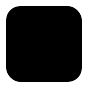

# Pattern Modifiers



Web app for generating STL files of 3D patterns and dynamic shapes for use as modifiers in slicer software (e.g. Bambu Studio, PrusaSlicer).

Set the build volume of your printer, tune the pattern, and download a watertight STL. The model is generated in printer coordinates (mm, Z-up) with the origin centred in X/Y at the bottom of the build volume, so it can be dropped into the slicer as a modifier with no repositioning. The overflow extends the model past the build volume on every side (including below the build plate) so the pattern fully encloses any printed model.

## How it works

- React + TypeScript app built with [Vite](https://vitejs.dev)
- Sidebar controls are driven by a [Zod](https://zod.dev) schema and rendered with [MUI](https://mui.com) sliders
- Form state is synced to the URL query string so settings can be shared and restored with browser back/forward
- Pattern is sampled from seeded 3D Perlin noise (with fBm octaves) and meshed with marching cubes; boundary samples are forced outside the surface so the mesh is always watertight and clipped flush to the volume
- 3D preview uses [React Three Fiber](https://docs.pmnd.rs/react-three-fiber); the same geometry is exported as binary STL via three.js `STLExporter`

The overall layout and form patterns are based on [BoxBuilder](https://github.com/jackcannon/boxbuilder).

## Parameters

| Parameter     | Default | Description |
|---------------|---------|-------------|
| Pattern Type  | Perlin Noise | Type of pattern to generate (more modes planned) |
| Width         | 330 mm  | Width of the build volume |
| Height        | 325 mm  | Height of the build volume |
| Depth         | 320 mm  | Depth of the build volume |
| Overflow      | 1 mm    | How far the pattern extends beyond the build volume on each side |
| Pattern Scale | 10 mm   | Size of the noise features |
| Threshold     | 50%     | How full the pattern is (higher = more solid) |
| Seed          | random  | Random seed for the noise pattern (new value on each fresh visit) |
| Octaves       | 2       | Number of noise layers |
| Persistence   | 0.15    | Contribution of each extra octave |
| Preview Resolution | 72  | Grid cells along the longest axis (3D preview) |
| Export Resolution  | 192 | Grid cells along the longest axis (STL export) |

## Setup

Requires [Bun](https://bun.sh).

```bash
git clone https://github.com/jackcannon/pattern-modifiers.git
cd pattern-modifiers
bun install
bun run dev
```

Open [http://localhost:5173](http://localhost:5173).

## Scripts

| Command         | Description                    |
|-----------------|--------------------------------|
| `bun run dev`   | Start the Vite dev server      |
| `bun run build` | Type-check and production build |
| `bun run preview` | Serve the production build locally |

## Deployment

The app is set up for static deployment on [Dokku](https://dokku.com) using custom buildpacks (Bun build + nginx). Relevant files:

- `.buildpacks` — env, Bun, and nginx buildpacks
- `.dokku.env` — sets `NGINX_ROOT='dist'`
- `.static` — marks the app as a static site

Build output goes to `dist/`. Push to your Dokku remote to deploy:

```bash
git push <dokku-remote> master
```

## Project structure

```
src/
├── App.tsx              # Layout: sidebar + 3D view
├── useHistoryDoc.ts     # Form state + URL/history sync
├── form/                # Schema, form config, slider inputs
├── sidebar/             # Logo, form, download button, footer
├── render/              # React Three Fiber canvas + generated mesh
└── generate/            # Perlin noise, marching cubes, geometry + STL export
public/
└── logo.svg             # App logo and favicon source
scripts/
└── verify-geometry.ts   # Sanity checks (winding, bounds, watertightness, STL)
```
